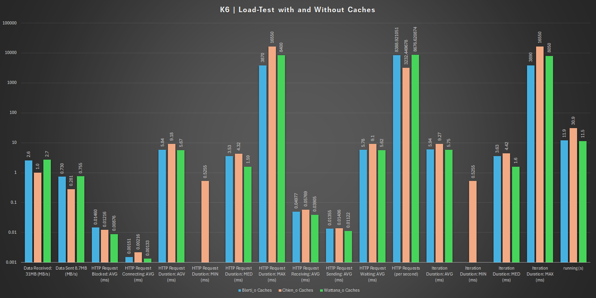
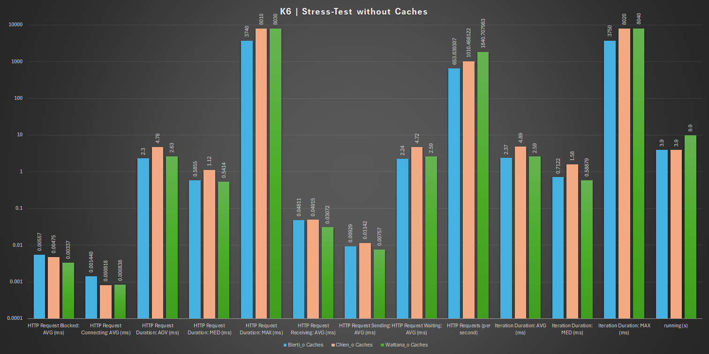

# Performance Test

## pgbench -U postgres -d performance_tests
	performance_tests -i -s 100					Blerti:			Chien:			Wattana:
	done in:									310.96 s		230.67 s		116.15 s
	drop tables:								0.01 s			0.00 s			0.45
	create tables:								0.06 s			0.04 s			0.04 s
	client-side generate:						252.61 s		161.83 s		82.06 s
	vacuum:										21.76 s			29.24 s			10.44 s
	primary keys:	 							36.52 s			39.56 s			23.17 s

#### Evaluation diagram: PostgresSQL: Database initialization
	

## performance_tests
												Blerti:			Chien:			Wattana:
	scaling factor:								100				100				100
	query mode:									simple			simple			simple
	number of clients:							1				1				1
	number of threads:							1				1				1
	maximum number of tries:					1				1				1
	number of transactions per client:			10				10				10
	number of transactions actually processed:	10/10			10/10			10/10
	number of failed transactions:				0 (0.000%)		0 (0.000%)		0 (0.000%)
	latency average:							16.677 ms		6.323 ms		4.141 ms
	initial connection time:					50.769 ms		49.497 ms		73.932 ms
	tps(without initial connection time):		59.962463		158.147773		212.571477	

#### Evaluation diagram: Performance in the single-client

	

## performance_tests -c 50 -t 10000
												Blerti:			Chien:			Wattana:
	scaling factor:								100				100				100
	query mode:									simple			simple			simple
	number of clients:							50				50				1
	number of threads:							1				1				1
	maximum number of tries:					1				1				1
	number of transactions per client:			10000			10000			10000
	number of transactions actually processed:	500000/500000	500000/500000	500000/500000
	number of failed transactions:				0 (0.000%)		0 (0.000%)		0 (0.000%)
	latency average:							23.486 ms		17.352 ms		13.530 ms
	initial connection time:					2463.641 ms		837.051 ms		673.834 ms
	tps(without initial connection time):		2128.873132		2881.435300		3695.375750

#### Evaluation diagram: Performance in the multi-client

## load-test | CACHE_ACTIVE = "true"
	scenarios: (100.00%) 1 scenario, 50 max VUs, 10m30s max duration (incl. graceful stop):
	* default: 100000 iterations shared among 50 VUs (maxDuration: 10m0s, gracefulStop: 30s)

		✗ response code was 200
		↳  0% — ✓ 0 / ✗ 100000
	  
### Blerti:
	checks:						0.00%			0 out of 100000
	data_received:				31 MB			983 kB/s
	data_sent:					8.7 MB			272 kB/s
	http_req_blocked:			avg=30.49µs		min=0s			med=0s			max=41.55ms		p(90)=0s		p(95)=0s
	http_req_connecting:		avg=3.11µs		min=0s			med=0s			max=11.21ms		p(90)=0s		p(95)=0s
	http_req_duration:			avg=15.23ms		min=771.1µs		med=10.86ms		max=3.97s		p(90)=22.12ms	p(95)=27.65m
	http_req_failed:			100.00%			100000 out of 100000	
	http_req_receiving:			avg=175.9µs		min=0s			med=0s			max=31.16ms		p(90)=545.9µs	p(95)=640µs
	http_req_sending:			avg=47.55µs		min=0s			med=0s			max=22.29ms		p(90)=0s		p(95)=145µs
	http_req_tls_handshaking:	avg=0s			min=0s			med=0s			max=0s			p(90)=0s		p(95)=0s
	http_req_waiting:			avg=15.01ms		min=771.1µs		med=10.67ms		max=3.97s		p(90)=21.74ms	p(95)=27.12ms
	http_reqs:					100000			3130.099793/s
	iteration_duration:			avg=15.51ms		min=1.59ms		med=11.11ms		max=4.01s		p(90)=22.5ms	p(95)=28.08ms				
	iterations:					100000			3130.099793/s
	running:					(00m31.9s)		00/50 VUs		100000 complete and 0 interrupted iterations
	default ✓					50 VUs			00m31.9s/10m0s	100000/100000 shared iters

### Chien:
	checks:						0.00%			0 out of 100000
	data_received:				31 MB			2.2 MB/s
	data_sent:					8.7 MB			616 kB/s
	http_req_blocked:			avg=10.86µs		min=0s			med=0s			max=13.84ms		p(90)=0s		p(95)=0s
	http_req_connecting:		avg=1.27µs		min=0s			med=0s			max=3.13ms		p(90)=0s		p(95)=0s
	http_req_duration:			avg=6.93ms		min=0s			med=3.19ms		max=7.16s		p(90)=4.94ms	p(95)=5.69ms
	http_req_failed:			100.00%			100000 out of 100000
	http_req_receiving:			avg=58.11µs		min=0s			med=0s			max=10.73ms		p(90)=0s		p(95)=531.29µs
	http_req_sending:			avg=16.17µs		min=0s			med=0s			max=5.53ms		p(90)=0s		p(95)=0s
	http_req_tls_handshaking:	avg=0s			min=0s			med=0s			max=0s			p(90)=0s		p(95)=0s
	http_req_waiting:			avg=6.86ms		min=0s			med=3.15ms		max=7.16s		p(90)=4.84ms	p(95)=5.55ms
	http_reqs:					100000			7080.730961/s
	iteration_duration:			avg=7.04ms		min=0s			med=3.24ms		max=7.17s		p(90)=5.06ms	p(95)=5.86ms
	iterations:					100000			7080.730961/s
	running:					(00m14.1s)		00/50 VUs		100000 complete and 0 interrupted iterations
	default ✓					50 VUs  		00m14.1s/10m0s	100000/100000 shared iters

### Wattana:
	checks:						0.00%			0 out of 100000
	data_received:				31 MB			3.1 MB/s
	data_sent:					8.7 MB			858 kB/s
	http_req_blocked:			avg=9.39µs		min=0s			med=0s			max=13.57ms		p(90)=0s		p(95)=0s
	http_req_connecting:		avg=1.27µs		min=0s			med=0s			max=3.87ms		p(90)=0s		p(95)=0s
	http_req_duration:			avg=1.92ms		min=0s			med=1.61ms		max=8.03s		p(90)=2.67ms	p(95)=3.15ms
	http_req_failed:			100.00%			100000 out of 100000
	http_req_receiving:			avg=40.6µs		min=0s			med=0s			max=5.16ms		p(90)=0s		p(95)=522.4µs
	http_req_sending:			avg=12.13µs		min=0s			med=0s			max=4.24ms		p(90)=0s		p(95)=0s
	http_req_tls_handshaking:	avg=0s			min=0s			med=0s			max=0s			p(90)=0s		p(95)=0s
	http_req_waiting:			avg=1.86ms		min=0s			med=1.59ms		max=8.03s		p(90)=2.64ms	p(95)=2.98ms
	http_reqs:					100000			9863.302129/s
	iteration_duration:			avg=2ms			min=0s			med=1.63ms		max=8.04s		p(90)=2.72ms	p(95)=3.23ms
	iterations:					100000			9863.302129/s
	running:					(00m10.1s)		00/50 VUs		100000 complete and 0 interrupted iterations
	default ✓					50 VUs			00m10.1s/10m0s	100000/100000 shared iters				

#### Evaluation diagram: Load-Test with Caches

## load-test | CACHE_ACTIVE = "false"

### Blerti:
	checks:						0.00%			0 out of 100000
	data_received:				31 MB			2.6 MB/s
	data_sent:					8.7 MB			730 kB/s
	http_req_blocked:			avg=14.6µs		min=0s			med=0s			max=25.01ms		p(90)=0s		p(95)=0s
	http_req_connecting:		avg=1.51µs		min=0s			med=0s			max	=7.31ms		p(90)=0s		p(95)=0s
	http_req_duration:			avg=5.84ms		min=0s			med=3.53ms		max=3.87s		p(90)=6.14ms	p(95)=7.26ms
	http_req_failed:			100.00%			100000 out of 100000
	http_req_receiving:			avg=49.77µs		min=0s			med=0s			max=9.72ms		p(90)=0s		p(95)=513.59µs
	http_req_sending:			avg=13.55µs		min=0s			med=0s			max=7.1ms		p(90)=0s		p(95)=0s
	http_req_tls_handshaking:	avg=0s			min=0s			med=0s			max=0s			p(90)=0s		p(95)=0s
	http_req_waiting:			avg=5.78ms		min=0s			med=3.45ms		max=3.87s		p(90)=6.05ms	p(95)=7.14ms
	http_reqs:					100000			8388.921051/s
	iteration_duration:			avg=5.94ms		min=0s			med=3.63ms		max=3.89s		p(90)=6.27ms	p(95)=7.39ms
	iterations:					100000			8388.921051/s
	running:					(00m11.9s)		00/50 VUs		100000 complete and 0 interrupted iterations
	default ✓					50 VUs			00m11.9s/10m0s  100000/100000 shared iters				

### Chien:
	checks:						0.00%			0 out of 100000
	data_received:				31 MB			1.0 MB/s
	data_sent:					8.7 MB			281 kB/s
	http_req_blocked:			avg=12.16µs		min=0s			med=0s			max=17.29ms		p(90)=0s		p(95)=0s
	http_req_connecting:		avg=2.16µs		min=0s			med=0s			max=5.41ms		p(90)=0s		p(95)=0s
	http_req_duration:			avg=9.18ms		min=525.5µs		med=4.32ms		max=16.55s		p(90)=8.37ms	p(95)=10ms
	http_req_failed:			100.00%			100000 out of 100000
	http_req_receiving:			avg=57.69µs		min=0s			med=0s			max=30.96ms		p(90)=0s		p(95)=527.8µs
	http_req_sending:			avg=14.06µs		min=0s			med=0s			max=13.27ms		p(90)=0s		p(95)=0s
	http_req_tls_handshaking:	avg=0s			min=0s			med=0s			max=0s			p(90)=0s		p(95)=0s
	http_req_waiting:			avg=9.1ms		min=525.5µs		med=4.29ms		max=16.55s		p(90)=8.27ms	p(95)=9.91ms
	http_reqs:					100000			3232.449678/s
	iteration_duration:			avg=9.27ms		min=525.5µs		med=4.42ms		max=16.55s		p(90)=8.48ms	p(95)=10.13ms
	iterations:					100000			3232.449678/s
	running:					(00m30.9s)		00/50 VUs		100000 complete and 0 interrupted iterations 
	default ✓					50 VUs			00m30.9s/10m0s	100000/100000 shared iters

### Wattana:
	checks:						0.00%			0 out of 100000
	data_received:				31 MB			2.7 MB/s
	data_sent:					8.7 MB			755 kB/s
	http_req_blocked:			avg=8.76µs		min=0s			med=0s			max=12.67ms		p(90)=0s		p(95)=0s
	http_req_connecting:		avg=1.33µs		min=0s			med=0s			max=4.13ms		p(90)=0s		p(95)=0s
	http_req_duration:			avg=5.67ms		min=0s			med=1.59ms		max=8.04s		p(90)=2.48ms	p(95)=2.78ms
	http_req_failed:			100.00%			100000 out of 100000
	http_req_receiving:			avg=39.05µs		min=0s			med=0s			max=5.84ms		p(90)=0s		p(95)=522.4µs
	http_req_sending:			avg=11.22µs		min=0s			med=0s			max=3.56ms		p(90)=0s		p(95)=0s
	http_req_tls_handshaking:	avg=0s			min=0s			med=0s			max=0s			p(90)=0s		p(95)=0s
	http_req_waiting:			avg=5.62ms		min=0s			med=1.58ms		max=8.04s		p(90)=2.32ms	p(95)=2.72ms
	http_reqs:					100000			8676.620874/s
	iteration_duration:			avg=5.75ms		min=0s			med=1.6ms		max=8.05s		p(90)=2.64ms	p(95)=2.92ms
	iterations:					100000			8676.620874/s
	running:					(00m11.5s)		00/50 VUs		100000 complete and 0 interrupted iterations    
	default ✓					50 VUs			00m11.5s/10m0s	100000/100000 shared iters 				

#### Evaluation diagram: Load-Test without Caches

#### Evaluation diagram: Load-Test with and without Caches

## stress-test | CACHE_ACTIVE = "true"
	scenarios: (100.00%) 1 scenario, 2000 max VUs, 4m30s max duration (incl. graceful stop):
	* breaking: Up to 2000 looping VUs for 4m0s over 8 stages (gracefulRampDown: 30s, gracefulStop: 30s)

### Blerti:
		✗ response code was 200
		↳  0% — ✓ 0 / ✗ 1167

	checks:						0.00%			0 out of 1167
	data_received:				366 kB			98 kB/s
	data_sent:					102 kB			27 kB/s
	http_req_blocked:			avg=5.38µs		min=0s			med=0s			max=1.06ms		p(90)=0s		p(95)=0s
	http_req_connecting:		avg=1.45µs		min=0s			med=0s			max=1.06ms		p(90)=0s		p(95)=0s
	http_req_duration:			avg=1.47ms		min=0s			med=1.24ms		max=12.97ms		p(90)=2.35ms	p(95)=2.84ms
	http_req_failed:			100.00%			1167 out of 1167
	http_req_receiving:			avg=63.9µs		min=0s			med=0s			max=1.63ms		p(90)=214.26µs	p(95)=512.44µs
	http_req_sending:			avg=9.64µs		min=0s			med=0s			max=1.53ms		p(90)=0s		p(95)=0s
	http_req_tls_handshaking:	avg=0s			min=0s			med=0s			max=0s			p(90)=0s		p(95)=0s
	http_req_waiting:			avg=1.4ms		min=0s			med=1.18ms		max=12.97ms		p(90)=2.22ms	p(95)=2.68ms
	http_reqs:					1167			313.325298/s
	iteration_duration:			avg=1.6ms		min=0s			med=1.35ms		max=13.33ms 	p(90)=2.54ms   p(95)=2.99ms
	iterations:					1167			313.325298/s
	vus:						3				min=1			max=3
	vus_max:					2000			min=2000		max=2000
	running:					(0m03.7s)		0000/2000 VUs	1167 complete and 4 interrupted iterations
	default ✓					0004/2000 VUs	0m03.7s/4m00.0s
 
### Chien:
		✗ response code was 200
		↳  0% — ✓ 0 / ✗ 1845

	checks:						0.00%			0 out of 1845
	data_received:				580 kB			149 kB/s
	data_sent:					161 kB			41 kB/s
	http_req_blocked:			avg=4.91µs		min=0s			med=0s			max=552.69µs	p(90)=0s		p(95)=0s
	http_req_connecting:		avg=833ns		min=0s			med=0s			max=531.4µs		p(90)=0s		p(95)=0s
	http_req_duration:			avg=1.1ms		min=0s			med=1.06ms		max=16.99ms		p(90)=1.62ms	p(95)=2.18ms
	http_req_failed:			100.00%			1845 out of 1845
	http_req_receiving:			avg=50.32µs		min=0s			med=0s			max=1.24ms		p(90)=0s		p(95)=536.38µs
	http_req_sending:			avg=13.49µs		min=0s			med=0s			max=1ms			p(90)=0s		p(95)=0s
	http_req_tls_handshaking:	avg=0s			min=0s			med=0s			max=0s			p(90)=0s		p(95)=0s
	http_req_waiting:			avg=1.04ms		min=0s			med=1.05ms		max=16.99ms		p(90)=1.61ms	p(95)=2.17ms
	http_reqs:					1845			473.391401/s
	iteration_duration:			avg=1.2ms		min=0s			med=1.07ms		max=17.48ms		p(90)=1.65ms	p(95)=2.21ms
	iterations:					1845			473.391401/s
	vus:						3				min=1			max=3
	vus_max:					2000			min=2000		max=2000
	running:					(0m03.9s)		0000/2000 VUs	1845 complete and 4 interrupted iterations
	default ✓					0004/2000 VUs	0m03.9s/4m00.0s 			

### Wattana:
		✗ response code was 200
		↳  0% — ✓ 0 / ✗ 8904

	checks:						0.00%			0 out of 8904
	data_received:				2.8 MB			282 kB/s
	data_sent:					775 kB			78 kB/s
	http_req_blocked:			avg=3.34µs		min=0s			med=0s			max=1.58ms		p(90)=0s		p(95)=0s
	http_req_connecting:		avg=539ns		min=0s			med=0s			max=1.01ms		p(90)=0s		p(95)=0s
	http_req_duration:			avg=5.45ms		min=0s			med=538.4µs		max=9.11s		p(90)=1.07ms	p(95)=1.1ms
	http_req_failed:			100.00%			8904 out of 8904
	http_req_receiving:			avg=27.7µs		min=0s			med=0s			max=7.8ms		p(90)=0s		p(95)=320µs
	http_req_sending:			avg=7µs			min=0s			med=0s			max=703.7µs		p(90)=0s		p(95)=0s
	http_req_tls_handshaking:	avg=0s			min=0s			med=0s			max=0s			p(90)=0s		p(95)=0s
	http_req_waiting:			avg=5.42ms		min=0s			med=536.1µs		max=9.11s		p(90)=1.07ms	p(95)=1.09ms
	http_reqs:					8904			897.896846/s
	iteration_duration:			avg=5.52ms		min=0s			med=553.9µs		max=9.11s		p(90)=1.08ms	p(95)=1.13ms
	iterations:					8904			897.896846/s
	vus:						9				min=1			max=9
	vus_max:					2000			min=2000		max=2000
	running:					(0m09.9s)		0000/2000 VUs	8904 complete and 9 interrupted iterations
	default ✓					0009/2000 VUs	0m09.9s/4m00.0s  					

#### Evaluation diagram: Stress-Test with Caches

## stress-test | CACHE_ACTIVE = "false"

### Blerti:
		✗ response code was 200
		↳  0% — ✓ 0 / ✗ 2527

	checks:						0.00%			0 out of 2527
	data_received:				794 kB			206 kB/s
	data_sent:					220 kB			57 kB/s
	http_req_blocked:			avg=5.57µs		min=0s			med=0s			max=2.01ms		p(90)=0s		p(95)=0s
	http_req_connecting:		avg=1.44µs		min=0s			med=0s			max=2.01ms		p(90)=0s		p(95)=0s
	http_req_duration:			avg=2.3ms		min=0s			med=585.5µs		max=3.74s		p(90)=1.22ms	p(95)=1.63ms
	http_req_failed:			100.00%			2527 out of 2527
	http_req_receiving:			avg=48.11µs		min=0s			med=0s			max=1ms			p(90)=143.84µs	p(95)=524µs
	http_req_sending:			avg=9.29µs		min=0s			med=0s			max=1.52ms		p(90)=0s		p(95)=0s
	http_req_tls_handshaking:	avg=0s			min=0s			med=0s			max=0s			p(90)=0s		p(95)=0s
	http_req_waiting:			avg=2.24ms		min=0s			med=552.2µs		max=3.74s		p(90)=1.16ms	p(95)=1.54ms
	http_reqs:					2527			653.839307/s
	iteration_duration:			avg=2.37ms		min=0s			med=712.2µs		max=3.75s		p(90)=1.33ms	p(95)=1.71ms
	iterations:					2527			653.839307/s
	vus:						4				min=1			max=4
	vus_max:					2000			min=2000		max=2000
	running:					(0m03.9s)		0000/2000 VUs, 2527 complete and 4 interrupted iterations  
	default ✓					0004/2000 VUs	0m03.9s/4m00.0s					

### Chien:
		✗ response code was 200
		↳  0% — ✓ 0 / ✗ 9999

	checks:						0.00%			0 out of 9999
	data_received:				3.1 MB			317 kB/s
	data_sent:					871 kB			88 kB/s
	http_req_blocked:			avg=4.75µs		min=0s			med=0s			max=1.07ms		p(90)=0s		p(95)=0s
	http_req_connecting:		avg=818ns		min=0s			med=0s			max=1.03ms		p(90)=0s		p(95)=0s
	http_req_duration:			avg=4.78ms		min=0s			med=1.12ms		max=8.01s		p(90)=2.15ms	p(95)=2.67ms
	http_req_failed:			100.00%			9999 out of 9999
	http_req_receiving:			avg=49.15µs		min=0s			med=0s			max=1.22ms		p(90)=0s		p(95)=533.69µs
	http_req_sending:			avg=11.42µs		min=0s			med=0s			max=1.1ms		p(90)=0s		p(95)=0s
	http_req_tls_handshaking:	avg=0s			min=0s			med=0s			max=0s			p(90)=0s		p(95)=0s
	http_req_waiting:			avg=4.72ms		min=0s			med=1.09ms		max=8.01s		p(90)=2.14ms	p(95)=2.66ms
	http_reqs:					9999			1010.468122/s
	iteration_duration:			avg=4.89ms		min=0s			med=1.58ms		max=8.02s		p(90)=2.18ms	p(95)=2.7ms
	iterations:					9999			1010.468122/s
	vus:						9				min=1			max=9
	vus_max:					2000			min=2000		max=2000
	running:					(0m09.9s)		0000/2000 VUs	9999 complete and 9 interrupted iterations
	default ✓					0009/2000 VUs	0m09.9s/4m00.0s

### Wattana:
		✗ response code was 200
		↳  0% — ✓ 0 / ✗ 18278
	checks:						0.00%			0 out of 18278
	data_received:				3.1 MB			578 kB/s
	data_sent:					871 kB			160 kB/s
	http_req_blocked:			avg=3.37µs		min=0s			med=0s			max=2ms			p(90)=0s		p(95)=0s
	http_req_connecting:		avg=838ns		min=0s			med=0s			max=1.19ms		p(90)=0s		p(95)=0s
	http_req_duration:			avg=2.63ms		min=0s			med=541.4µs		max=8.03s		p(90)=1.08ms	p(95)=1.11ms
	http_req_failed:			100.00%			18278 out of 18278
	http_req_receiving:			avg=30.72µs		min=0s			med=0s			max=1ms			p(90)=0s		p(95)=517.1µs
	http_req_sending:			avg=7.57µs		min=0s			med=0s			max=1ms			p(90)=0s		p(95)=0s
	http_req_tls_handshaking:	avg=0s			min=0s			med=0s			max=0s			p(90)=0s		p(95)=0s
	http_req_waiting:			avg=2.59ms		min=0s			med=538µs		max=8.03s		p(90)=1.07ms		p(95)=1.1ms
	http_reqs:					18278			1840.707983/s
	iteration_duration:			avg=2.69ms		min=0s			med=588.79µs	max=8.04s		p(90)=1.09ms	p(95)=1.16ms
	iterations:					18278			1840.707983/s
	vus:						9				min=1			max=9
	vus_max:					2000			min=2000		max=2000
	running:					(0m09.9s)		0000/2000 VUs	9999 complete and 9 interrupted iterations
	default ✓					0009/2000 VUs	0m09.9s/4m00.0s				

#### Evaluation diagram: Stress-Test without Caches

#### Evaluation diagram: Stress-Test with and without Caches
